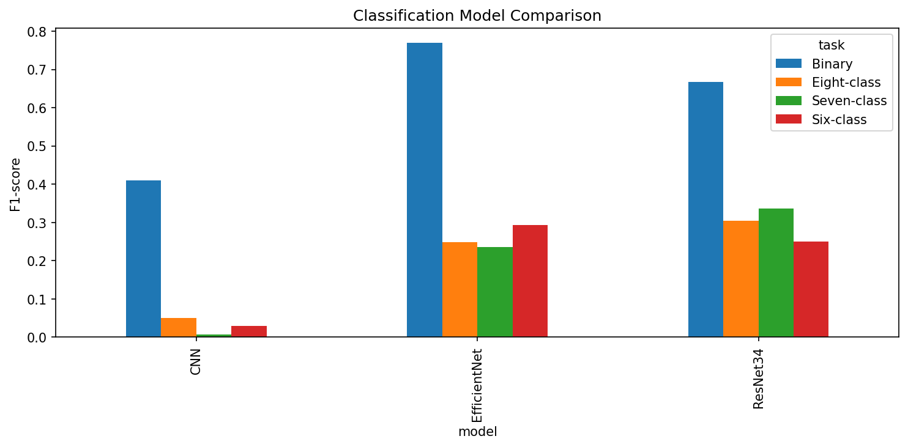
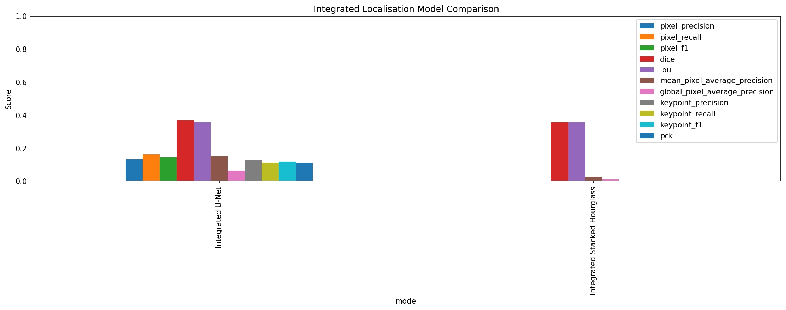
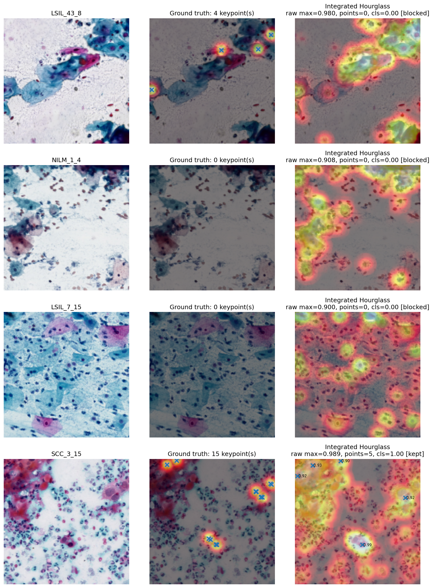

# Visual Results Folder Guide

This ZIP is sorted for the GitHub repository. Copy the `results/` and `README-assets/` folders into the root of the repo.

## Folder meaning

- `results/eda/` - dataset distribution and EDA figures.
- `results/classification/binary/` - binary classification confusion matrices.
- `results/classification/multiclass/` - six-class, seven-class and eight-class multiclass results.
- `results/classification/overall/` - overall classification comparison charts.
- `results/classification/feature_maps/` - classifier feature map visualisation.
- `results/localisation/metrics/` - localisation metric comparison charts.
- `results/localisation/training/` - U-Net and Stacked Hourglass training curves.
- `results/localisation/confusion_matrices/` - pixel-level confusion matrices.
- `results/localisation/calibration/` - threshold calibration plot.
- `results/localisation/examples/` - integrated prediction examples and representative error cases.
- `README-assets/` - selected images that are useful to embed directly in the GitHub README.

## Suggested README images

Use these in the README:

```markdown



```
